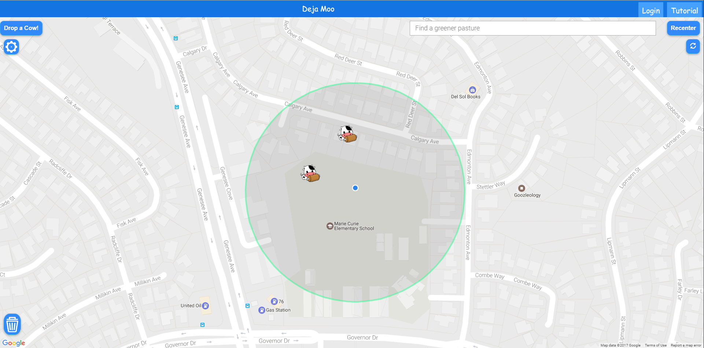
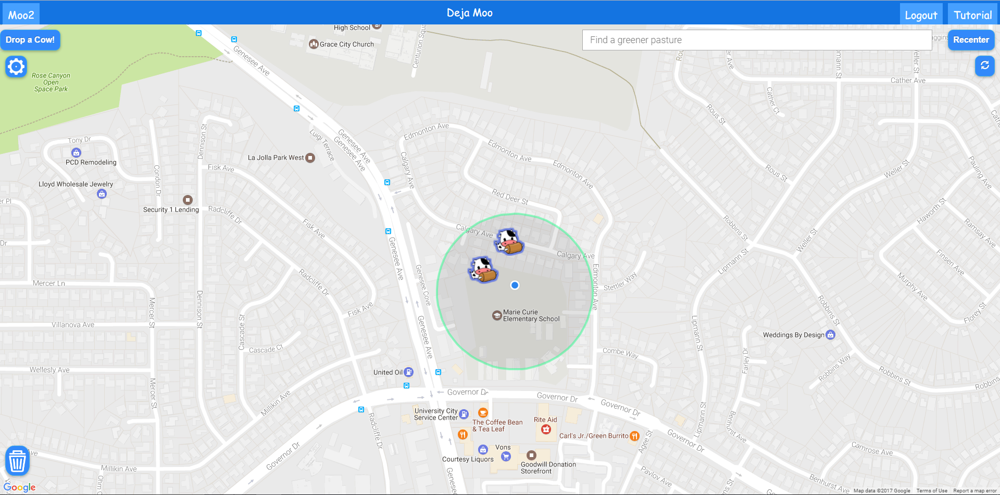
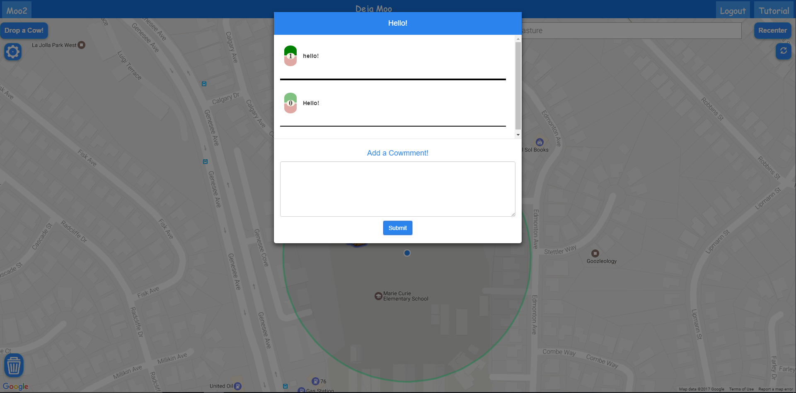

# Contributions

## Siyu
Changed fonts, added images to tutorial, changed preview boxes to hover only, added transition of initial load, UI button locations, bug fixes.

## Ricky
Changed login page, implemented full login functionality with database, voting once per user, CSS to show if a comment was voted by a user, outer glow to signify the user's own cows, sweet alert confirmation for the delete buttons.

## Phillip
Changed voting algorithm, moved UI elements around, and redesigned the UI. Also fixed a big issue with AJAX
requests would "crash" Node.js. In addition, the clustering of markers was fixed and visually improved.

## Arvin
Designed new buttons and reorganized layout

## Screenshot

This iteration mostly focuses on improving UI design, as well as enforcing a simpler UI look. In addition,
this iteration also fixes multiple bugs that were present from the previous iteration. The comments boxes
were also improved for user readability.
